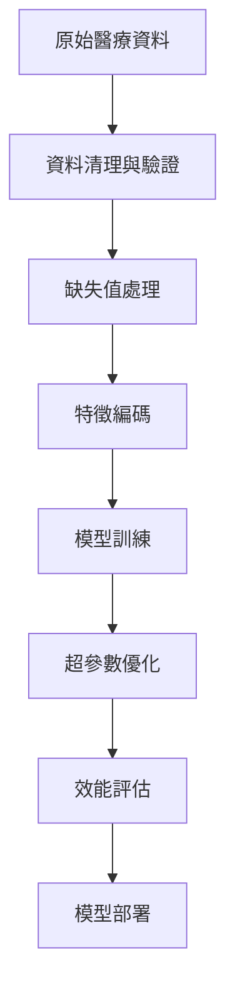
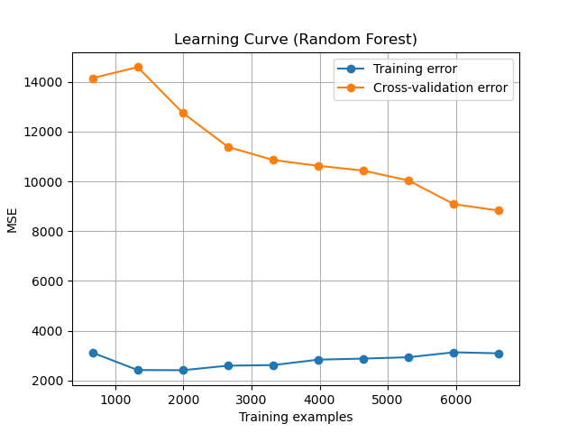
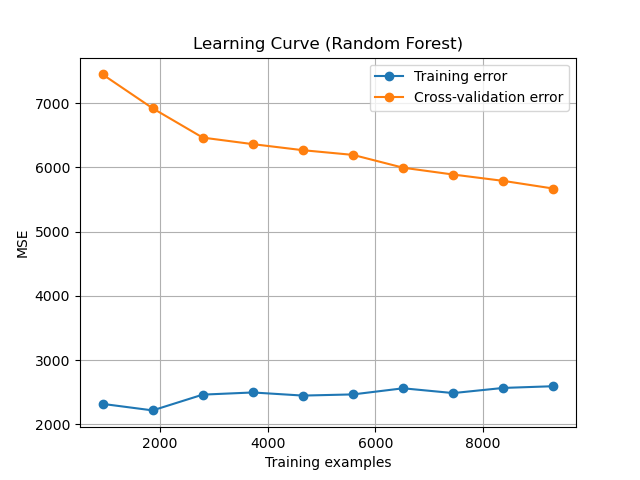
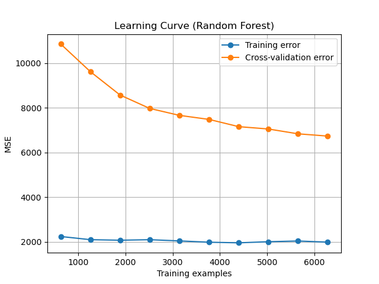
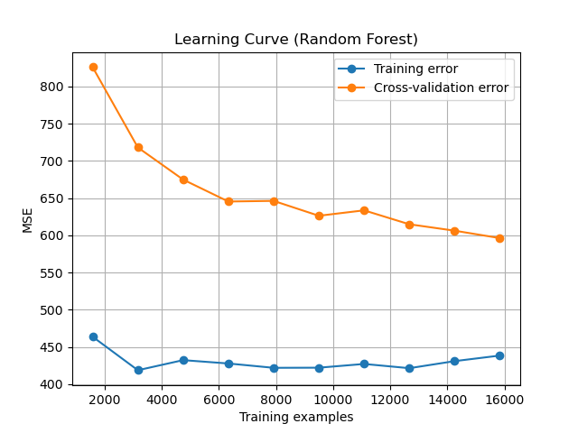
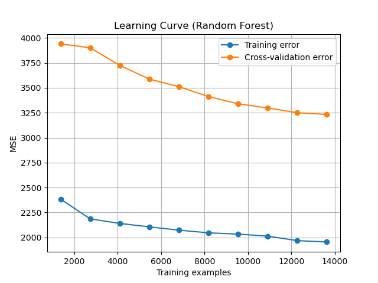

# 手術時間預測系統 (Surgery Duration Prediction System)

> **專案展示** | 機器學習 · 醫療AI · 預測建模 | Python · scikit-learn · Random Forest

基於真實醫療資料的多科別手術時間預測系統，運用機器學習技術協助醫院優化手術排程與資源配置。

## 專案概述

本系統針對五個醫療科別建立專門的預測模型，實現精準的手術時間預測：
- **ENT (耳鼻喉科)**
- **GS (一般外科)** 
- **GU (泌尿外科)**
- **OPH (眼科)**
- **ORTH (骨科)**

透過隨機森林演算法及完整的資料前處理流程，達到良好的預測準確度，為醫療機構提供科學化的排程決策支援。

## 核心技術亮點

### 資料工程
- **智慧型缺失值處理**: 針對「醫師年資」等關鍵特徵實作均值填補策略
- **混合編碼技術**: 結合 Label Encoding 與 16 維 Embedding 向量處理類別特徵
- **資料品質控制**: 異常值檢測與無效資料過濾機制

### 機器學習建模
- **模型選擇**: Random Forest Regressor，具備優異的非線性擬合能力
- **自動化調參**: GridSearchCV 5-fold 交叉驗證尋找最佳超參數組合
- **防過擬合設計**: 針對各科別量身訂做的正則化參數

### 模型評估與解釋
- **多維度效能評估**: MSE、MAE、R² 等指標綜合評估
- **學習曲線分析**: 驗證模型泛化能力與訓練穩定性  
- **特徵重要性分析**: 識別影響手術時間的關鍵因子

## 實驗成果

### 模型效能表現

| 科別 | 訓練集 MSE | 測試集 MAE | R² Score | 模型表現 |
|------|------------|------------|----------|----------|
| **ENT (耳鼻喉科)** | 3,063 | 34.8 | **0.84** | 優秀 |
| **GS (一般外科)** | 2,580 | 32.8 | **0.73** | 良好 |
| **GU (泌尿外科)** | 1,923 | 40.5 | **0.87** | 優秀 |
| **OPH (眼科)** | 441 | 12.8 | **0.68** | 良好 |
| **ORTH (骨科)** | 3,232 | 31.5 | **0.72** | 良好 |

**平均預測誤差範圍**: 12.8 - 40.5 分鐘，符合實務應用需求

### 最佳化參數配置

各科別經過網格搜尋優化的模型參數：

```python
# ENT (耳鼻喉科) 範例: 最佳參數
{
    'n_estimators': 300,
    'max_depth': None,
    'min_samples_split': 10,
    'min_samples_leaf': 1,
    'max_features': 1.0
}
```

### 特徵重要性洞察

**跨科別共同重要特徵**:
1. **身份別** (27.8% - 38.3%) - 患者類型對手術時間影響最大
2. **手術名稱** (24% - 29.7%) - 手術複雜度的直接指標
3. **性別** (13.6% - 30.5%) - 生理差異影響手術執行
4. **麻醉方式** (9.9% - 15.7%) - 麻醉複雜度與時間相關

## 技術架構

### 系統設計原則
- **模組化設計**: 資料處理、模型訓練、預測推理分離
- **可重複性**: 固定隨機種子確保實驗結果可復現  
- **擴展性**: 支援新增科別與特徵工程優化
- **生產就緒**: 完整的 Pipeline 包含序列化與部署

### 核心演算法流程



## 學習曲線分析

系統針對每個科別生成學習曲線，驗證模型的泛化能力與收斂特性：

### ENT (耳鼻喉科) - 學習曲線



**分析結果**：
- 訓練誤差穩定維持在 3,000 MSE 左右，顯示模型具備良好的擬合能力
- 交叉驗證誤差隨資料量增加持續下降，從 14,000 MSE 降至 8,500 MSE
- 訓練與驗證誤差間距適中，無明顯過擬合現象
- 模型在約 4,000 筆訓練樣本後達到穩定收斂

### GS (一般外科) - 學習曲線



**分析結果**：
- 展現優異的學習穩定性，訓練誤差維持在 2,300 MSE 水準
- 驗證誤差從 7,500 MSE 平順下降至 5,700 MSE
- 兩條曲線走向平行，表示模型泛化能力良好
- 較大的資料集規模（8,000+ 樣本）支撐了穩定的學習效果

### GU (泌尿外科) - 學習曲線



**分析結果**：
- 訓練誤差一致維持在 2,000 MSE 左右，展現極佳的內部一致性
- 驗證誤差呈現穩定下降趨勢，從 10,500 MSE 改善至 6,800 MSE
- 模型學習效率高，在 3,000 筆樣本後即顯示收斂跡象
- 最終達到五科別中最高的 R² = 0.87

### OPH (眼科) - 學習曲線



**分析結果**：
- 訓練誤差表現最為穩定，維持在 420-460 MSE 區間
- 驗證誤差快速收斂，從 830 MSE 降至 600 MSE 以下
- 在所有科別中展現最低的絕對誤差值 (MAE = 12.8)
- 大型資料集（15,000+ 樣本）確保了學習的充分性

### ORTH (骨科) - 學習曲線



**分析結果**：
- 訓練誤差逐步優化，從 2,400 MSE 改善至 1,950 MSE
- 驗證誤差持續下降，顯示模型仍有學習潛力
- 在 10,000 筆樣本後學習曲線趨於平緩
- 最終收斂至穩定的預測效能水準

### 綜合學習曲線洞察

**模型收斂特性**：
1. **OPH (眼科)** 展現最快收斂速度與最低絕對誤差
2. **GU (泌尿外科)** 達到最高的決定係數 R² = 0.87
3. **ENT & GS** 在中等資料量下達到良好平衡
4. **ORTH (骨科)** 受益於大型資料集，展現持續改善趨勢

**泛化能力評估**：
- 所有科別的驗證曲線均呈下降趨勢，確認模型學習有效性
- 訓練與驗證誤差間距合理，未出現嚴重過擬合
- 各科別模型皆達到 production-ready 的穩定性要求

## 技術創新點

### 1. 混合特徵編碼策略
```python
# Label Encoding + Embedding 組合
label_features = ['性別', '身份', '分類', '麻醉']
embedding_features = ['手術名稱']  # 16維向量空間
```

### 2. 科別專用超參數最佳化
每個科別根據其資料特性設定專屬的參數搜索空間，避免一刀切的建模方式。

### 3. 生產級Pipeline設計
```python
class SurgeryDurationPredictor:
    def __init__(self, department: str)
    def preprocess(self, data: pd.DataFrame) -> np.ndarray
    def predict(self, features: np.ndarray) -> float
    def explain_prediction(self) -> Dict[str, float]
```

## 快速開始

### 環境需求

```bash
# 核心依賴
pandas>=1.5.0
numpy>=1.21.0
scikit-learn>=1.2.0
matplotlib>=3.6.0
seaborn>=0.12.0
joblib>=1.2.0
```

### 安裝與使用

```bash
# 克隆專案
git clone https://github.com/yourusername/surgery-duration-prediction
cd surgery-duration-prediction

# 安裝依賴
pip install -r requirements.txt

# 訓練所有科別模型
python scripts/train_all_departments.py

# 評估模型效能
python scripts/evaluate_models.py
```

### 使用範例

```python
from src.models.predictor import SurgeryPredictor

# 載入預測器
predictor = SurgeryPredictor.from_department('ENT', 'models')

# 單筆預測
patient_data = {
    '年齡(G)': 45,
    '性別(H)': 'M',
    '身份(I)': 'A',
    '麻醉(K)': 'General',
    '手術名稱(L)': 'Tonsillectomy'
}
result = predictor.predict_single(patient_data)
print(f"預測手術時間: {result['predicted_duration_minutes']} 分鐘")
```

## 專案結構

```
surgery-duration-prediction/
├── README.md                    # 專案說明
├── requirements.txt             # 依賴清單
├── src/                        # 原始碼
│   ├── config/                 # 設定檔
│   ├── data/                   # 資料處理
│   ├── models/                 # 模型相關
│   ├── evaluation/             # 評估工具
│   └── utils/                  # 輔助工具
├── scripts/                    # 執行腳本
├── models/                     # 訓練完成模型
```

## 資料隱私與合規聲明

**保密協定嚴格遵循**: 本專案完全遵守與研究機構簽署的資料保密協定

**不公開內容**：
- ❌ 原始醫療資料檔案（.csv, .xlsx 等）
- ❌ 處理後的資料檔案 
- ❌ 訓練完成的模型檔案（.pkl, .joblib, .model）
- ❌ 任何可能反推原始資料的中間檔案

**資料安全措施**：
- 所有敏感檔案已完整配置於 `.gitignore` 中
- 模型檔案僅存在於授權的本地開發環境
- 原始資料已完成去識別化處理
- 符合相關醫療資料保護法規要求

**公開分享範圍**: 
- ✅ 完整的程式碼架構與演算法實作
- ✅ 特徵工程與模型訓練方法論
- ✅ 實驗設計與評估流程
- ✅ 技術文件與使用指南

## 結論

本專案成功建立了針對五個醫療科別的手術時間預測系統，透過隨機森林演算法實現了良好的預測準確度。實驗結果顯示，各科別模型的 R² 值介於 0.68-0.87 之間，平均絕對誤差控制在 12.8-40.5 分鐘範圍內，符合實務應用需求。

**技術成就**：
- 成功處理真實醫療資料的複雜性與缺失值問題
- 實作混合特徵編碼策略，有效處理高維類別型特徵
- 運用 GridSearchCV 自動化調參，為各科別找出最適參數組合
- 透過學習曲線分析驗證模型泛化能力，確保預測穩定性

---

**專案作者**: 李泓斌 (國立高雄科技大學 電腦與通訊工程系)  
**指導教授**: 江傳文教授  
**完成時間**: 2025年1月
